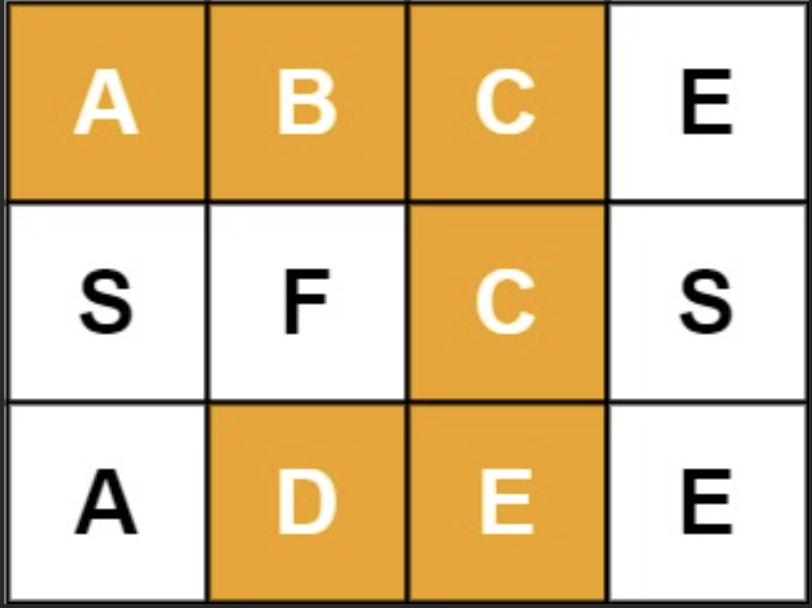
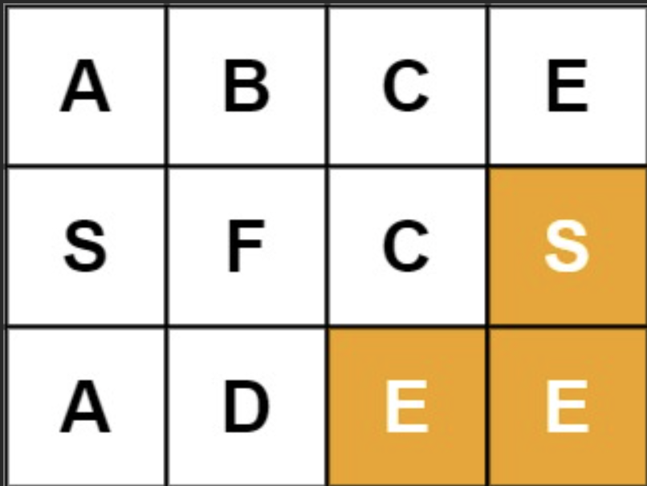
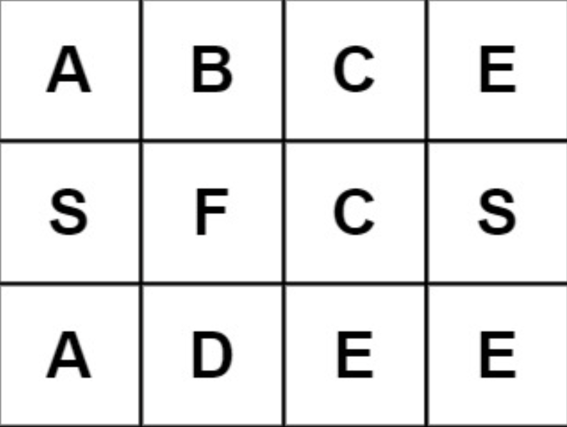

# 36. [Word Search](https://leetcode.com/problems/word-search/)

Given an `m x n` grid of characters `board` and a string `word`, return `true` if `word` exists in the grid.

The word can be constructed from letters of sequentially adjacent cells, where adjacent cells are horizontally or vertically neighboring. The same letter cell may not be used more than once.

#### <b>Example 1</b>:


```
<b>Input</b>:
board = [["A","B","C","E"],["S","F","C","S"],["A","D","E","E"]]
word = "ABCCED"
<b>Output</b>: true
```

#### <b>Example 2</b>:


```
<b>Input</b>:
board = [["A","B","C","E"],["S","F","C","S"],["A","D","E","E"]]
word = "SEE"
<b>Output</b>: true
```
#### <b>Example 3</b>:


```
<b>Input</b>:
board = [["A","B","C","E"],["S","F","C","S"],["A","D","E","E"]]
word = "ABCB"
<b>Output</b>: false
```

#### <b>Constraints</b>:

* `m == board.length`
* `n = board[i].length`
* `1 <= m, n <= 6`
* `1 <= word.length <= 15`
* `board` and `word` consists of only lowercase and uppercase English letters

#### <b>Follow up</b>: Could you use search pruning to make your solution faster with a larger `board`?

#### My Notes: